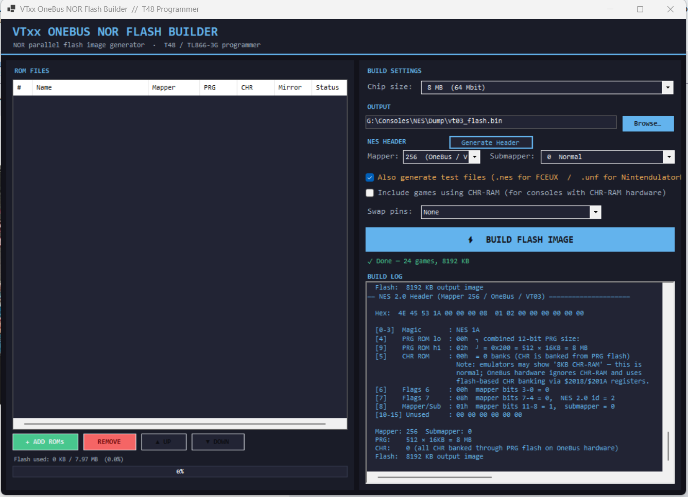

# VTxx OneBus NOR Flash Multicart — NES 2.0 Mapper 256 

https://www.nesdev.org/wiki/NES_2.0_Mapper_256/Submapper_table

Creates multy game rom for replase built in games on VTxx OneBus  Famiclone consoles (NES 620in1), portable handheld with TV output (like SUP 400in1). LCD does not support yet.
Not tested on real hardware yet. 
Download the latest release or clone the repo and build project. Make shure to have `original_menu_patched.rom` in the same folder as the executable.

Download TVxxMultiRom_win-x64.7z for windows 64-bit: https://github.com/Shelvadim/VTxxMultiRom/releases

## Output Files

| File | Purpose |
|------|---------|
| `multicart.bin` | Raw NOR flash image — flash this to the chip |
| `multicart.nes` | NES 2.0 mapper 256 — open in **NintendulatorNRS** or FCEUX (NROM + MMC3) |
| `multicart.unf` | UNIF UNL-OneBus — open in **NintendulatorNRS** (works for NROM + MMC3) |

### Emulator compatibility

| Emulator | NROM/CNROM | MMC3 |
|----------|-----------|------|
| NintendulatorNRS + `.unf` | ✓ | ✓ |
| FCEUX + `.nes` | ✓ | ✗ grey screen (some MMC3) |

---

## Compatible NOR Flash Chips

The VT0x OneBus console uses a **parallel NOR flash** in **TSOP48**  **TSOP56** package, running at **3.3 V**.

---

## Flashing with T48 (TL866-3G) + Xgpro

### What you need

- T48 programmer (TL866-3G) with Xgpro software installed
- **TSOP48 adapter** for the T48 — sold separately, required for this chip package
- The `multicart.bin` file built by this tool

---

## MMC3 Game Compatibility

The VT0x OneBus hardware MMC3 emulator works with most standard MMC3 games but has limits.

### Grey screen on hardware (rejected by builder)

- **CHR-RAM games** (`chr_banks = 0`) — VT0x MMC3 emulator expects CHR-ROM
  - Castlevania III, Adventures of Lolo 1–3, Solstice
  - These are blocked at load time with `✗ CHR-RAM` in the Status column

### May grey screen (warned with `⚠ IRQ?`)

- Games with PRG > 256 KB that depend on cycle-accurate MMC3 scanline IRQ
  - Kirby's Adventure, Mega Man 3–6, Super Mario Bros. 3, Contra (some versions)
  - If the game uses IRQ only for music (not raster effects) it will usually still work

---

## Chip Size vs. Capacity

The first 512 KB is always occupied by the menu kernel (`original_menu_patched.rom`).

## Resources
https://github.com/Wassermann1/sup400  dassasembled dump from handheld RetroFC (sup 400in1 game console)
https://www.nesdev.org/
NintendulatorNRS https://www.emucr.com/2025/12/nintendulatornrs-20251224.html

